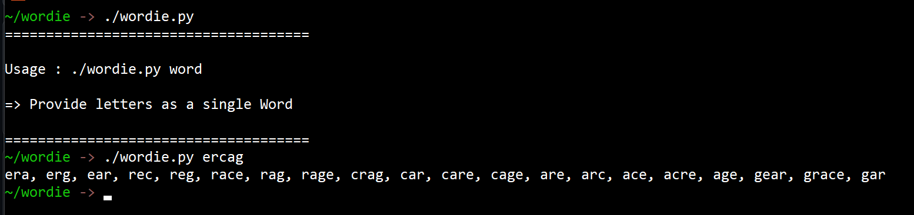

# Wordie
* A script which will generate all possible words for the game [Words of Wonders](https://play.google.com/store/apps/details?id=com.fugo.wow&hl=en_IN&gl=US).
* I played this game for few weeks and decided to try my scripting skills in python to find words .. 

### Modules Used
* Itertools
* pyenchant

### Installation and Usage
```
  git clone https://github.com/donjod/Wordie.git
  cd Wordie/
  chmod +x wordie.py
  ./wordy.py 
```

**Note**: The script may generate some words which aren't accepted by the game.


